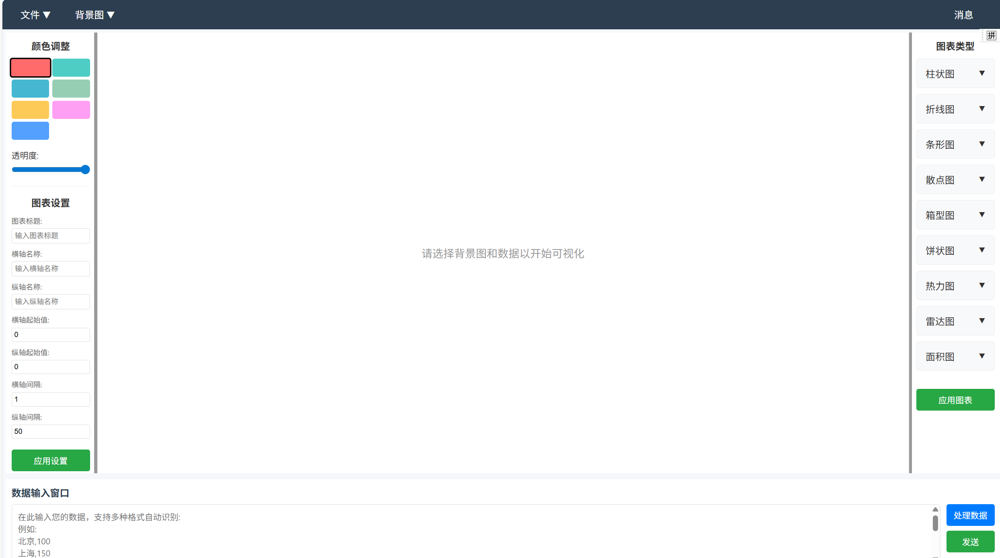
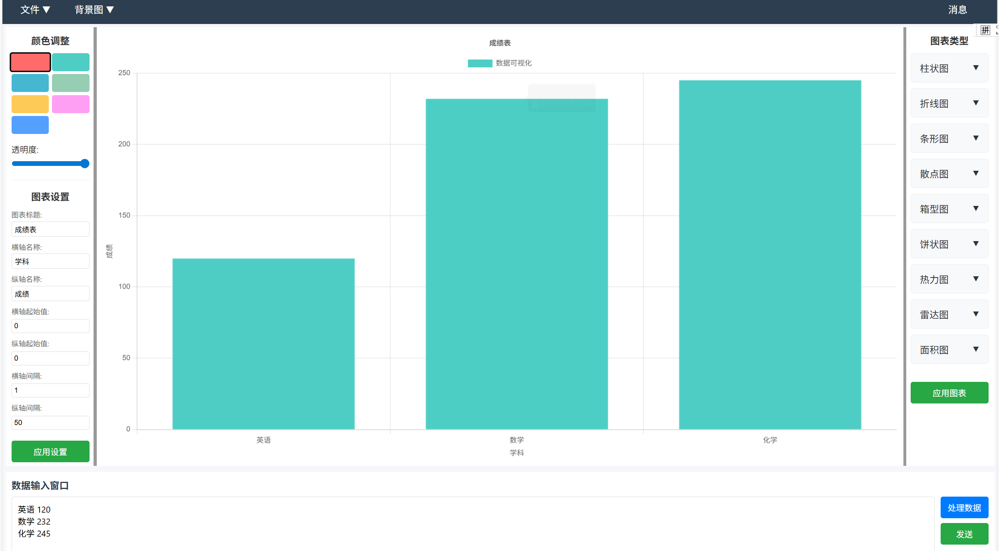
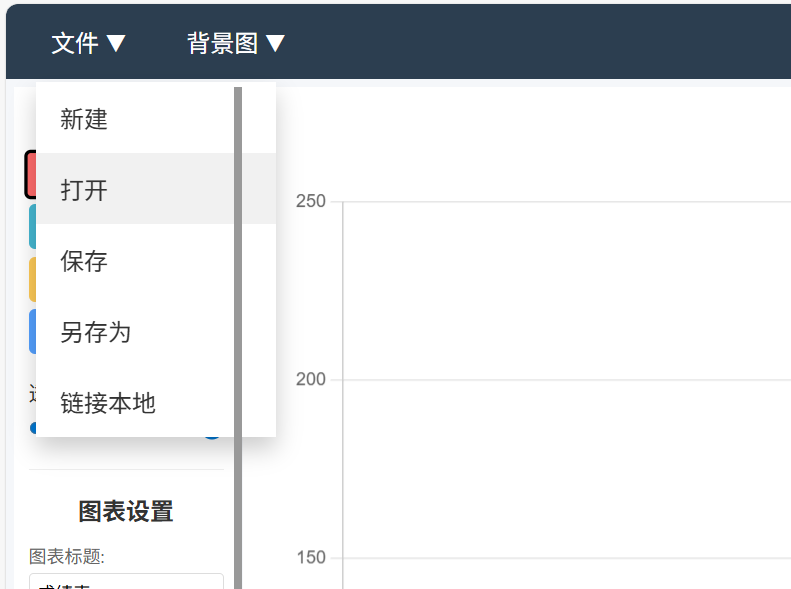
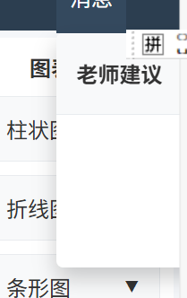

# 数据可视化工具

这是一个功能丰富的数据可视化工具，针对日常数据中可视化困难等问题，可以选择自定义的输入数据，也可以从excel表格中导入数据，支持多种图表类型，包括柱状图、折线图、饼图、散点图等。针对日常中图表达不到需求，采用教师反馈系统，老师可以看到可视化图表并且可以发送建议。


## 版本说明

本项目提供了两个版本：
1. 基于HTML/JavaScript的前端版本（原始版本）(推荐运行heml版本)
2. 基于Gradio的Python版本

## 功能特点

- 支持多种数据输入格式（文本、JSON、CSV）
- 多种图表类型支持
- 可自定义颜色，自定义透明度。
- 支持保存图表为图片
- 老师反馈系统

## 安装和运行

### 前端版本（HTML/JavaScript）

直接在浏览器中打开 `index.html` 文件即可使用。

### 后端服务器（原始Node.js版本）

1. 确保已安装Node.js (推荐版本 12.0 或更高)
2. 启动服务器：
   ```
   node server.js
   ```
   
   也可以直接运行 `start-server.bat` (Windows)

3. 打开浏览器访问 `http://localhost:3000`

### Gradio版本（推荐）

1. 确保已安装Python (推荐版本 3.7 或更高)
2. 安装依赖包：
   ```
   pip install -r requirements.txt
   ```

3. 启动应用：
   ```
   python app.py
   ```
   
   也可以直接运行 `start-gradio.bat` (Windows)

4. 打开浏览器访问 `http://localhost:3000`

## 使用说明

### 数据输入
支持多种数据格式输入：
- 简单列表：`语文 90\n数学 85\n英语 88`
- JSON格式：`[{"label": "语文", "value": 90}, {"label": "数学", "value": 85}]`
- CSV格式：`语文,90\n数学,85\n英语,88`

在输入栏输入后要发送才可处理，然后点击应用图标，左侧可以选择图表名称，横纵轴名称和起始值。

新建可以新建一个图像，打开可以打开excel文件然后将数据传入，在行列数据都有时，传入数据会选择折线图或者条形图。保存可以将图片保存在本地。
### 图表类型
- 柱状图：显示数据对比
- 折线图：显示数据趋势
- 饼图：显示数据占比
- 散点图：显示数据分布

### 老师反馈系统
学生可以将制作的图表发送给老师，老师可以在系统中查看并提供反馈建议。
,可以与老师进行交互，看到老师的修改意见，目前不是很完善。


## API接口

服务器提供以下API接口：

- `POST /api/charts` - 接收学生发送的图表数据
- `GET /api/charts` - 获取所有已接收的图表
- `GET /api/charts/:id` - 获取特定ID的图表
- `POST /api/messages` - 添加老师消息
- `GET /api/messages` - 获取所有消息

## 开发

前端代码位于 `js/` 和 `css/` 目录中，服务器端代码在 `server.js` 文件中。

## 故障排除

### 无法访问服务器
1. 确保Node.js已正确安装
2. 检查端口3000是否被其他程序占用
3. 检查防火墙设置是否阻止了端口3000

### 联网功能无法工作
1. 确保服务器正在运行
2. 检查浏览器控制台是否有错误
3. 确保前端和后端在同一网络环境下

## 许可证

MIT